# Proyek Akhir: Menyelesaikan Permasalahan Institusi Pendidikan

## Sistem Peringatan Dini Dua Horizon untuk Retensi Mahasiswa Jaya Jaya Institut

| | |
|---|---|
| **Nama** | Muhammad Shobir Abdussyakur |
| **ID Dicoding** | `souba676` |
| **Kelas** | Belajar Penerapan Data Science |
| **Dashboard** | Pusat Pemantauan Retensi Mahasiswa (Metabase **v0.63.10**, 18 visualisasi, 4 penyaring) |
| **Model** | Regresi Logistik untuk horizon gerbang, Extra Trees untuk horizon tahun pertama |
| **Prototipe** | Streamlit, empat ruang kerja |
| **Tautan prototipe** | <PLACEHOLDER_URL_STREAMLIT> |

> **Tautan prototipe Streamlit Community Cloud:** <PLACEHOLDER_URL_STREAMLIT>
>
> Akun masuk tidak diperlukan, aplikasi dapat langsung dicoba. Berkas contoh
> `dataset/mahasiswa_aktif.csv` sudah disertakan di dalam repositori sehingga seluruh
> ruang kerja bisa dijalankan tanpa mengunggah apa pun.

---

## Business Understanding

Jaya Jaya Institut adalah perguruan tinggi yang berdiri sejak tahun 2000 dan telah
meluluskan banyak alumni dengan reputasi baik. Di sisi lain, terdapat cukup banyak
mahasiswa yang berhenti di tengah jalan atau dropout. Manajemen ingin mendeteksi sedini
mungkin mahasiswa yang berpotensi dropout supaya mereka dapat diberi bimbingan khusus
sebelum keputusan berhenti benar benar diambil.

Persoalannya bukan sekadar menghitung berapa banyak mahasiswa yang berhenti. Institusi
sudah tahu jumlah itu setiap akhir tahun akademik, dan pada saat itu tidak ada lagi yang
bisa dilakukan. Yang belum dimiliki adalah kemampuan menyebut nama, jauh sebelum
mahasiswa benar benar pergi.

Bimbingan hanya bermanfaat kalau datang selagi masih ada waktu untuk mengubah hasil.
Karena itu proyek ini tidak membangun satu model, melainkan dua model yang menjawab
pertanyaan yang sama pada dua titik waktu berbeda.

| Horizon | Kapan dipakai | Data yang boleh dipakai | Bentuk tindakan |
|---|---|---|---|
| **Gerbang masuk** | Saat mahasiswa baru diterima | Berkas pendaftaran, latar belakang keluarga, kondisi keuangan awal | Program pengenalan terarah, penempatan mentor, penawaran keringanan biaya |
| **Akhir tahun pertama** | Setelah dua semester pertama tuntas | Seluruh data gerbang ditambah catatan akademik dua semester | Bimbingan akademik perorangan, kontrak studi, penyesuaian beban |

Memakai nilai semester dua untuk menilai mahasiswa yang baru mendaftar adalah kebocoran
waktu: informasi itu belum ada ketika keputusan perlu diambil. Pemisahan horizon membuat
setiap model hanya memakai informasi yang benar benar tersedia pada saat ia dipakai.

### Permasalahan Bisnis

1. Institusi belum mengetahui faktor apa saja yang paling menentukan seorang mahasiswa
   berhenti studi, sehingga program pencegahan disusun berdasarkan dugaan.
2. Institusi belum bisa menyebut siapa yang berisiko sebelum mahasiswa benar benar
   berhenti, padahal bimbingan khusus hanya bisa diberikan kepada nama, bukan kepada
   angka rata rata.
3. Kapasitas bimbingan terbatas. Jumlah dosen wali dan konselor jauh lebih sedikit
   daripada jumlah mahasiswa, sehingga institusi butuh urutan prioritas, bukan sekadar
   daftar panjang.
4. Institusi belum memiliki alat pantau mandiri. Setiap pertanyaan baru harus dijawab
   dengan permintaan laporan baru ke bagian akademik, dan jawabannya selalu terlambat.
5. Sebagian mahasiswa berstatus masih aktif dan hasil akhirnya belum diketahui. Kelompok
   inilah yang sebenarnya paling perlu dinilai, karena hanya merekalah yang masih bisa
   diselamatkan.

### Cakupan Proyek

1. Menjalankan seluruh tahapan proyek data science, dari business understanding, data
   understanding, exploratory data analysis, data preparation, modeling, evaluation,
   sampai deployment prototipe ke Streamlit Community Cloud.
2. Menguji hubungan setiap variabel terhadap status dropout memakai uji statistik, lalu
   menyusunnya menjadi peringkat sinyal yang dapat ditindaklanjuti.
3. Membangun dua model peringatan dini sesuai horizon waktunya, memilih ambang keputusan
   lewat perhitungan biaya, bukan lewat angka bawaan 0,5.
4. Membangun business dashboard Metabase agar bagian akademik dapat memantau sendiri
   sebaran risiko tanpa meminta laporan baru.
5. Membangun prototipe Streamlit yang dapat dipakai staf untuk menilai satu mahasiswa,
   menyusun antrean bimbingan sesuai kapasitas, dan mensimulasikan kebijakan.

### Persiapan

**Sumber data.** Berkas `dataset/data.csv` diunduh langsung dari repositori resmi
Dicoding:
<https://github.com/dicodingacademy/dicoding_dataset/tree/main/students_performance>.
Berkas memuat 4.424 baris dan 37 kolom dengan titik koma sebagai pemisah kolom. Tidak ada
nilai kosong maupun baris duplikat.

**Menyiapkan lingkungan.**

```bash
# 1. Buat dan aktifkan virtual environment, Python 3.12
python -m venv venv
venv\Scripts\activate           # Windows
# source venv/bin/activate      # Linux atau macOS

# 2. Pasang seluruh dependensi proyek
pip install -r requirements.txt

# 3. Tambahan khusus untuk menjalankan ulang notebook
pip install jupyter ipykernel

# 4. Jalankan notebook
jupyter notebook notebook.ipynb
```

**Struktur berkas submission.**

```
submission
├── model
│   ├── model_gerbang.joblib          model horizon gerbang masuk
│   ├── model_tahun_pertama.joblib    model horizon akhir tahun pertama
│   └── metadata_model.json           ambang, metrik, daftar fitur, nilai bawaan formulir
├── dataset
│   ├── data.csv                      dataset asli dari repositori Dicoding
│   ├── mahasiswa_aktif.csv           794 mahasiswa berstatus aktif
│   ├── mahasiswa_aktif_terskor.csv   mahasiswa aktif beserta skor kedua horizon
│   └── mahasiswa_berskor.csv         seluruh mahasiswa beserta skor, sumber dashboard
├── assets                            grafik notebook dan tangkapan layar prototipe
├── notebook.ipynb                    seluruh proses data science, sudah dijalankan
├── app.py                            prototipe Streamlit
├── fitur_akademik.py                 definisi kolom dan rekayasa fitur
├── kamus_kode.py                     penerjemah kode angka menjadi label
├── akademik_jji.db                   basis data SQLite sumber dashboard
├── metabase.db.mv.db                 instance Metabase berisi dashboard
├── souba676-dashboard.png            tangkapan layar dashboard
├── requirements.txt
└── README.md
```

---

## Data Understanding

Dataset berisi satu baris untuk setiap mahasiswa yang pernah terdaftar, dengan 36 kolom
masukan dan satu kolom `Status` sebagai label hasil akhir.

| Kelompok kolom | Isi | Jumlah kolom |
|---|---|---|
| Berkas pendaftaran | Jalur masuk, urutan pilihan, nilai ujian masuk, kualifikasi sebelumnya, waktu kuliah | 7 |
| Latar belakang pribadi dan keluarga | Usia, jenis kelamin, status pernikahan, kewarganegaraan, pendidikan dan pekerjaan orang tua | 9 |
| Kondisi keuangan | Status tunggakan, kelancaran pembayaran, kepemilikan beasiswa | 3 |
| Catatan akademik dua semester pertama | Mata kuliah diambil, dievaluasi, lulus, diakui, tanpa evaluasi, dan nilai rata rata | 12 |
| Kondisi makroekonomi | Tingkat pengangguran, inflasi, pertumbuhan ekonomi | 3 |
| Label | `Status`: Dropout, Enrolled, Graduate | 1 |

Sebaran status akhir mahasiswa:

| Status | Jumlah | Persentase |
|---|---|---|
| Graduate, lulus | 2.209 | 49,9 persen |
| Dropout, berhenti | 1.421 | 32,1 persen |
| Enrolled, masih aktif | 794 | 17,9 persen |

Status `Enrolled` berarti hasil akhirnya belum diketahui. Kelompok ini **dikeluarkan dari
data pelatihan** karena melatih model dengan label yang belum ada berarti mengajarinya
menebak. Mereka disimpan terpisah dan diskor pada bagian evaluasi, dan justru merekalah
sasaran akhir sistem ini.

---

## Exploratory Data Analysis

### Sinyal yang sudah terbaca sejak gerbang masuk

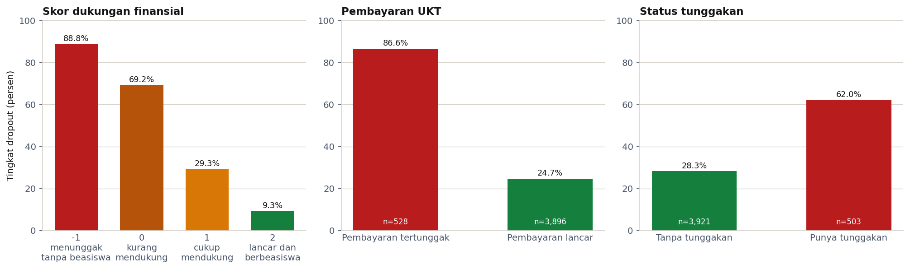

Kondisi keuangan adalah sinyal paling tajam yang sudah dimiliki institusi sejak hari
pertama, dan ia bekerja seperti tangga yang rapi. Skor dukungan finansial, gabungan
status beasiswa, kelancaran pembayaran, dan status tunggakan, memisahkan populasi dari
**88,8 persen** dropout pada kelompok terendah sampai **9,3 persen** pada kelompok
tertinggi. Dilihat satu per satu, mahasiswa dengan pembayaran uang kuliah tertunggak
berakhir dropout pada 86,6 persen kasus dibanding 24,7 persen pada yang lancar.

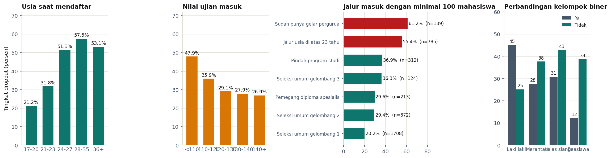

Usia dan jalur masuk menyusul di belakangnya. Tingkat dropout naik dari 21,2 persen pada
kelompok usia 17 sampai 20 tahun menjadi 57,5 persen pada kelompok 28 sampai 35 tahun.
Jalur usia di atas 23 tahun berakhir dropout pada 55,4 persen kasus dengan 785 mahasiswa,
sementara seleksi umum gelombang pertama hanya 20,2 persen dengan 1.708 mahasiswa.

### Sinyal yang baru muncul setelah tahun pertama

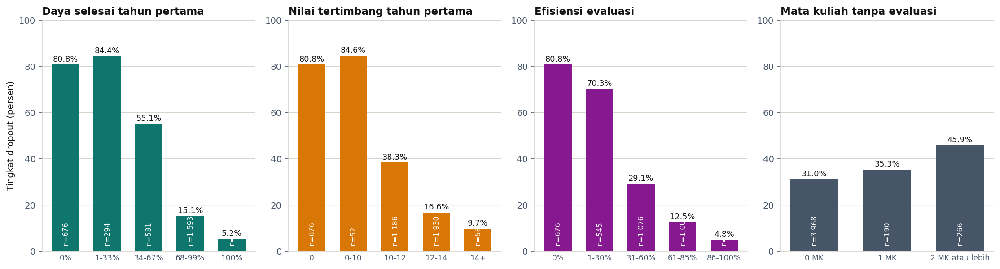

Begitu catatan tahun pertama masuk, kekuatan pemisahnya melampaui seluruh sinyal gerbang.
Daya selesai, yaitu rasio mata kuliah lulus terhadap yang diambil, memisahkan dari
**80,8 persen** dropout pada mahasiswa yang tidak meluluskan satu pun mata kuliah menjadi
**5,2 persen** pada mahasiswa yang meluluskan seluruhnya. Rentang 75 poin persen ini
tidak tertandingi variabel mana pun di tahap gerbang.

### Perbedaan antar program studi

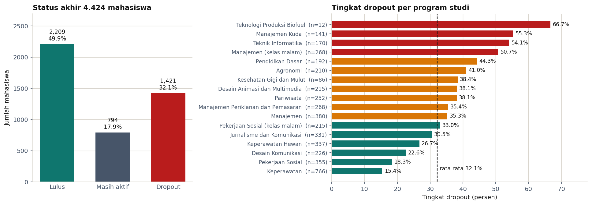

Angka rata rata institusi menyembunyikan perbedaan tajam antar program studi. Rentangnya
membentang dari 15,4 persen di Keperawatan sampai 55,3 persen di Manajemen Kuda, dengan
Teknik Informatika di 54,1 persen. Masalah dropout bukan masalah institusi secara merata,
melainkan terkonsentrasi pada segelintir program.

### Dugaan yang tidak terbukti

Uji statistik pada notebook menunjukkan tiga kolom makroekonomi, kewarganegaraan, dan
kebutuhan khusus tidak berhubungan secara bermakna dengan dropout. Latar belakang
pendidikan orang tua pun hampir tidak membedakan: tingkat dropout pada kelompok
pendidikan ibu jenjang perguruan tinggi 30,2 persen, hampir sama dengan jenjang
pendidikan dasar 31,5 persen.

---

## Modeling

### Membandingkan empat keluarga model pada kedua horizon

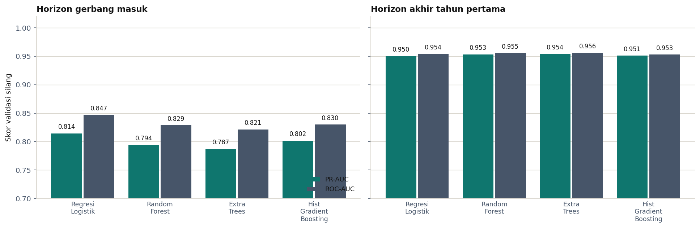

Empat kandidat diuji untuk setiap horizon lewat validasi silang lima lipatan pada data
latih. Ukuran pembanding utamanya PR-AUC, bukan akurasi, karena pada masalah dengan kelas
positif minoritas akurasi dapat terlihat tinggi hanya dengan menebak semua mahasiswa akan
lulus.

| Horizon | Regresi Logistik | Random Forest | Extra Trees | Hist Gradient Boosting |
|---|---|---|---|---|
| Gerbang masuk | **0,814** | 0,794 | 0,787 | 0,802 |
| Akhir tahun pertama | 0,950 | 0,953 | **0,954** | 0,951 |

Dua horizon menghasilkan pemenang yang berbeda, dan perbedaan itu masuk akal. Di gerbang
masuk, sinyal yang tersedia bergerak searah dan hampir tanpa lekukan, sehingga model
linier menangkapnya dengan efisien sementara model pohon berakhir sedikit overfitting.
Setelah catatan akademik masuk, muncul pola berambang seperti risiko yang melonjak begitu
daya selesai turun di bawah setengah, dan itu wilayah kerja model pohon.

Lompatan dari kisaran 0,81 ke kisaran 0,95 adalah temuan bisnis, bukan sekadar temuan
teknis: ia mengukur berapa banyak kepastian yang didapat institusi dengan menunggu satu
tahun.

### Penyetelan dan kalibrasi

Kandidat terpilih disetel dengan pencarian grid memakai skema validasi silang yang sama.
Regresi Logistik berhenti di `C = 0,3` dengan `min_frequency = 10`, dan Extra Trees di 300
pohon, `min_samples_leaf = 2`, serta `max_features = sqrt`.

Keluaran model kemudian dikalibrasi supaya benar benar terbaca sebagai peluang. Dua metode
diuji dan Platt scaling menang di kedua horizon. Selisih skor Briernya tipis, tetapi
pembedanya ada di perilaku ujung sebaran: metode isotonik memaksa 899 dari 2.904 prediksi
menjadi persis nol atau persis satu, sedangkan Platt scaling tidak menghasilkan satu pun.
Angka 1,00 di layar berarti model menyatakan mahasiswa pasti berhenti, dan klaim sekuat
itu tidak dapat dipertanggungjawabkan.

---

## Evaluation

### Daya pisah pada data uji

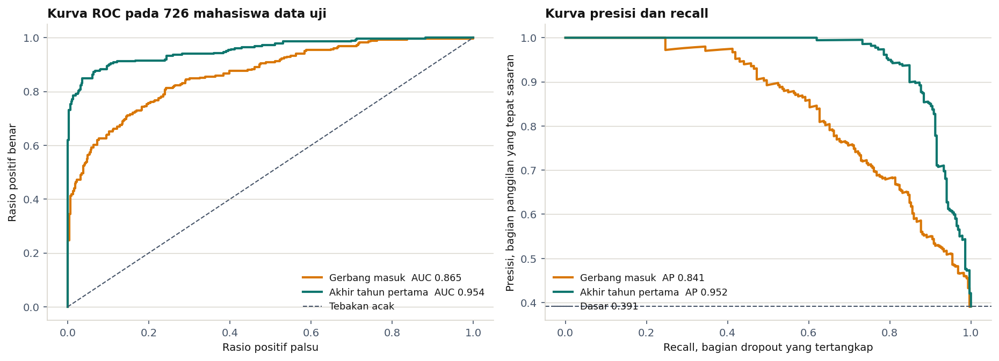

Seluruh angka berikut dihitung pada 726 mahasiswa yang belum pernah dilihat model, tidak
saat pelatihan, tidak saat penyetelan parameter, dan tidak saat pemilihan ambang.

| Metrik | Gerbang masuk | Akhir tahun pertama |
|---|---|---|
| ROC-AUC | 0,865 | **0,954** |
| PR-AUC | 0,841 | **0,952** |
| Skor Brier | 0,140 | **0,068** |
| Ambang keputusan | 0,22 | 0,40 |
| Akurasi | 0,711 | **0,906** |
| Presisi | 0,589 | **0,906** |
| Recall | 0,866 | 0,849 |
| F1 | 0,701 | **0,876** |

Pada recall 0,80, model tahun pertama masih mempertahankan presisi 0,950 sementara model
gerbang turun ke 0,683. Pada tingkat penangkapan yang sama, bimbingan berdasarkan model
gerbang akan jauh lebih sering menghampiri mahasiswa yang sebenarnya baik baik saja.

### Ambang keputusan dipilih lewat perhitungan biaya

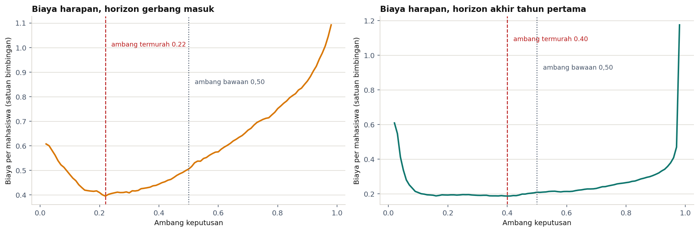

Ambang bawaan 0,5 mengandaikan dua jenis kesalahan sama mahalnya, dan pada kasus ini
anggapan itu keliru. Melewatkan calon dropout berarti kehilangan sisa uang kuliah
bertahun tahun beserta biaya akuisisi penggantinya, sedangkan memanggil mahasiswa yang
baik baik saja hanya memakai satu slot jam bimbingan.

Perbandingan biaya dasar ditetapkan **tiga banding satu** dan ambang dipilih pada titik
biaya harapan terendah, dihitung memakai probabilitas luar lipatan data latih sehingga
data uji tetap murni. Hasilnya 0,40 untuk model tahun pertama dan 0,22 untuk model
gerbang. Notebook menyajikan tabel sensitivitas untuk perbandingan 2, 3, 4, 5, 8, dan 12
banding satu, karena angka ini adalah keputusan kebijakan pimpinan dan bukan hasil
perhitungan statistik.

### Menerjemahkan model menjadi kapasitas kerja

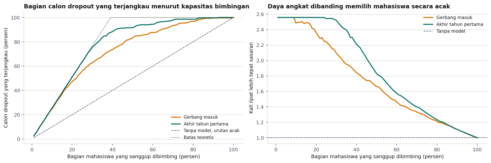

| Kapasitas bimbingan | Calon dropout terjangkau | Ketepatan daftar |
|---|---|---|
| 10 persen mahasiswa | 25,4 persen | 100 persen |
| 20 persen mahasiswa | 51,1 persen | 100 persen |
| 30 persen mahasiswa | 75,4 persen | 98,6 persen |

Memilih 20 persen mahasiswa secara acak hanya menjangkau 20 persen calon dropout, sehingga
model melipatgandakan hasil kerja tim bimbingan sebesar dua setengah kali.

### Faktor mana yang benar benar dipakai model

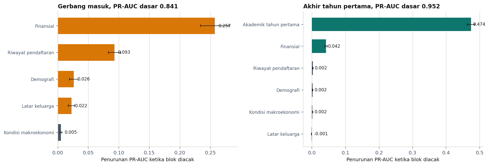

Kolom mentah satu blok diacak bersama sama, lalu penurunan PR-AUC diukur. Cara ini lebih
jujur daripada mengacak kolom satu per satu, karena kolom yang saling berkorelasi dapat
saling menutupi ketika diacak sendiri sendiri.

| Blok informasi | Gerbang masuk | Akhir tahun pertama |
|---|---|---|
| Akademik tahun pertama | tidak tersedia | **0,474** |
| Finansial | **0,257** | 0,042 |
| Riwayat pendaftaran | 0,093 | 0,003 |
| Demografi | 0,026 | 0,002 |
| Latar keluarga | 0,022 | tidak berpengaruh |
| Kondisi makroekonomi | 0,005 | 0,002 |

Institusi tidak perlu mengumpulkan data tambahan tentang keluarga mahasiswa untuk
keperluan peringatan dini. Yang perlu dijaga justru mutu pencatatan keuangan dan kecepatan
masuknya nilai semester ke sistem.

### Pita tindak lanjut

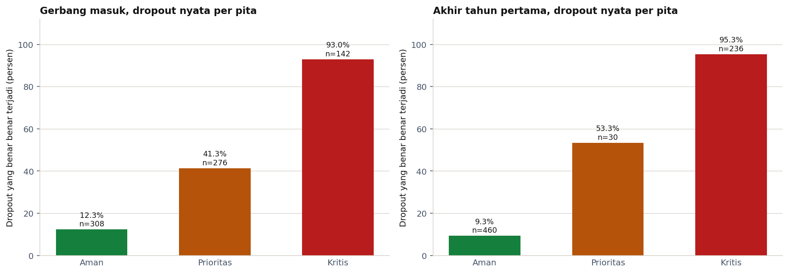

Tiga pita disusun dari ambang keputusan, bukan dari angka bulat sembarangan: pita Aman di
bawah ambang, pita Prioritas mulai dari ambang, dan pita Kritis mulai dari 0,65. Pada
model tahun pertama, pita Aman berisi 460 mahasiswa dengan hanya 9,3 persen dropout nyata,
sedangkan pita Kritis berisi 236 mahasiswa dengan 95,3 persen dropout nyata.

---

## Business Dashboard

Dashboard **Pusat Pemantauan Retensi Mahasiswa** dibangun di Metabase dan berisi **18
visualisasi** yang tersusun dalam empat seksi, dengan **4 penyaring interaktif** berupa
program studi, waktu kuliah, status pembayaran UKT, dan pita risiko model.

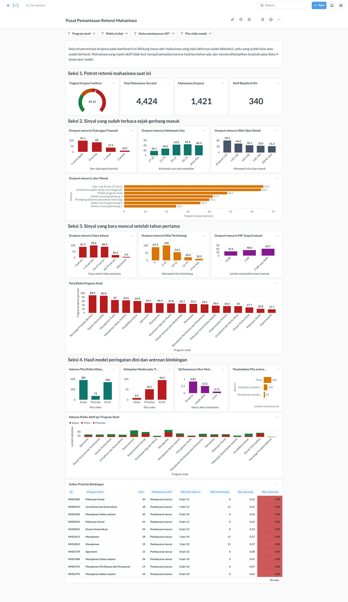

| Seksi | Isi | Pertanyaan yang dijawab |
|---|---|---|
| 1. Potret retensi saat ini | Tingkat dropout, total mahasiswa, jumlah dropout, jumlah mahasiswa aktif berpita kritis | Seberapa besar masalahnya hari ini |
| 2. Sinyal gerbang masuk | Dukungan finansial, kelompok usia, nilai ujian masuk, jalur masuk | Apa yang sudah bisa dibaca sebelum kuliah dimulai |
| 3. Sinyal tahun pertama | Daya selesai, nilai tertimbang, mata kuliah tanpa evaluasi, peta risiko 17 program studi | Apa yang berubah setelah satu tahun berjalan |
| 4. Hasil model | Sebaran pita mahasiswa aktif, ketepatan model per pita, uji kewarasan skor, perpindahan pita antar horizon, sebaran risiko per program studi, daftar prioritas bimbingan | Siapa yang harus dipanggil lebih dulu |

Seluruh persentase dropout pada dashboard dihitung hanya dari mahasiswa yang hasil
akhirnya sudah diketahui. Mahasiswa aktif tidak ikut menjadi penyebut karena hasilnya
belum ada, dan mereka ditampilkan terpisah pada Seksi 4 lewat skor model.

Skor pada dashboard bukan hasil hafalan model. Mahasiswa berlabel yang berada di bagian
data latih diberi skor lewat validasi silang, sedangkan bagian data uji diberi skor model
final, sehingga tidak ada satu pun mahasiswa yang dinilai oleh model yang pernah melihat
dirinya sendiri.

### Menjalankan dashboard

Kredensial masuk Metabase:

| | |
|---|---|
| **Email** | `root@mail.com` |
| **Password** | `root123` |

**Cara pertama, memakai Docker.** Jalankan perintah berikut dari dalam folder submission
ini, karena folder inilah yang berisi `metabase.db.mv.db` dan `akademik_jji.db`.

```bash
docker run -d -p 3000:3000 --name metabase \
  -v "$PWD/metabase.db.mv.db:/metabase.db/metabase.db.mv.db" \
  -v "$PWD/akademik_jji.db:/akademik_jji.db" \
  -v "$PWD/akademik_jji.db:/app/akademik_jji.db" \
  -e MB_DB_FILE=/metabase.db/metabase.db \
  metabase/metabase:v0.63.10
```

Tag versi ditulis eksplisit, bukan `latest`. Dashboard ini dibuat memakai **Metabase
v0.63.10**, dan berkas `metabase.db.mv.db` menyimpan skema internal versi tersebut.
Memakai image yang lebih baru berisiko memigrasi berkas itu dan membuatnya tidak bisa
dibuka lagi oleh v0.63.10.

Tunggu sampai log menampilkan `Metabase Initialization COMPLETE`, lalu buka
<http://localhost:3000> dan masuk memakai kredensial di atas. Dashboard berada di menu
Collections, dengan nama Pusat Pemantauan Retensi Mahasiswa.

**Cara kedua, memakai berkas jar tanpa Docker.** Unduh `metabase.jar` dari
<https://downloads.metabase.com/v0.63.10/metabase.jar> (versi yang sama, v0.63.10),
letakkan di mana saja, lalu jalankan perintah
berikut **dari dalam folder submission**:

```bash
# Java 21 diperlukan oleh Metabase v0.63.10
set MB_DB_TYPE=h2
set MB_DB_FILE=metabase.db
java -jar path\ke\metabase.jar
```

Working directory harus folder submission karena koneksi basis data memakai path relatif
`akademik_jji.db`. Menjalankannya dari folder lain membuat kartu dashboard gagal memuat
data.

---

## Menjalankan Sistem Machine Learning

Prototipe dibangun dengan Streamlit dan memiliki empat ruang kerja.

| Ruang kerja | Kegunaan |
|---|---|
| **Penilaian mahasiswa** | Menilai satu mahasiswa lewat formulir, lengkap dengan faktor yang mendorong dan menahan risikonya serta saran tindak lanjut sesuai pitanya |
| **Antrean bimbingan** | Mengunggah berkas CSV, menetapkan kapasitas konselor, lalu memperoleh daftar prioritas yang siap dijadwalkan dan diunduh kembali |
| **Simulasi kebijakan** | Memperkirakan pergeseran risiko satu angkatan bila sebuah kebijakan diterapkan pada sekian persen mahasiswa berisiko tertinggi |
| **Tentang model** | Ringkasan performa kedua model, cara ambang ditentukan, dan batasan pemakaian |

Model dipilih lewat bilah sisi: horizon gerbang masuk untuk mahasiswa baru diterima, dan
horizon akhir tahun pertama untuk mahasiswa yang sudah menempuh dua semester. Formulir
menyesuaikan diri secara otomatis, sehingga pertanyaan tentang nilai semester hanya muncul
ketika memang relevan.

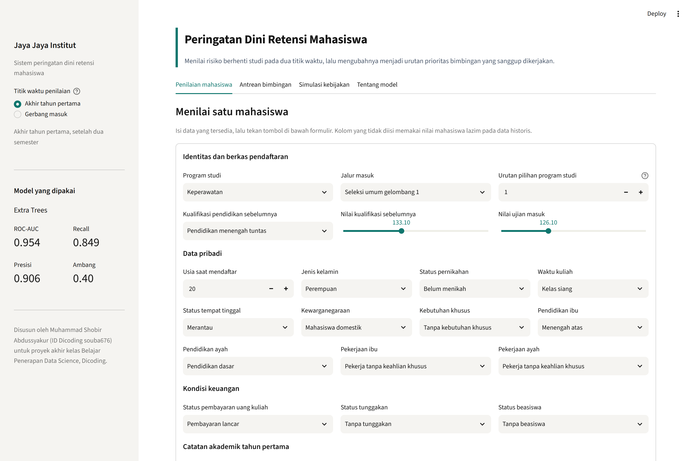

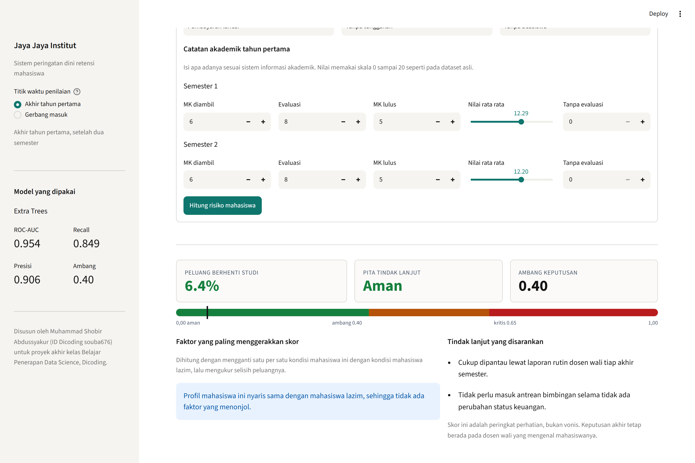

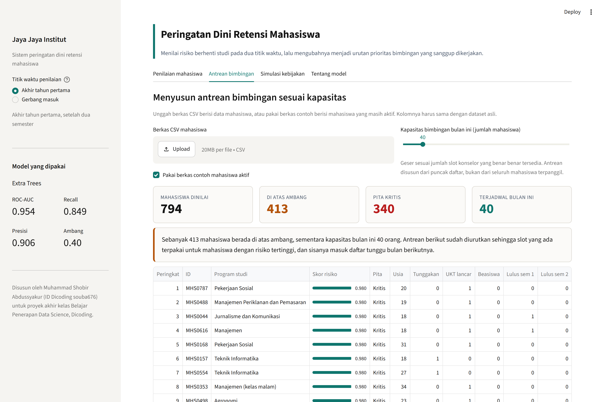

### Menjalankan secara lokal

```bash
pip install -r requirements.txt
streamlit run app.py
```

Aplikasi terbuka di <http://localhost:8501>. Berkas contoh berisi 794 mahasiswa aktif
sudah disertakan, sehingga tab antrean bimbingan dan simulasi kebijakan dapat langsung
dicoba tanpa mengunggah apa pun.

### Menjalankan di Streamlit Community Cloud

Prototipe sudah dihubungkan ke Streamlit Community Cloud dan dapat diakses secara remote
lewat tautan berikut:

**<PLACEHOLDER_URL_STREAMLIT>**

Langkah penyebaran yang dipakai:

1. Unggah seluruh isi folder `submission` ke sebuah repositori GitHub publik. Berkas
   `metabase.db.mv.db` dan `akademik_jji.db` tidak perlu ikut, keduanya sudah dikecualikan
   lewat `.gitignore` karena hanya dibutuhkan oleh dashboard, bukan oleh aplikasi.
2. Masuk ke <https://share.streamlit.io> memakai akun GitHub yang sama.
3. Pilih **Create app**, arahkan ke repositori tersebut, isi `app.py` sebagai main file
   path, lalu tekan **Deploy**.
4. Streamlit Community Cloud membaca `requirements.txt` secara otomatis dan memasang
   seluruh dependensi. Proses pertama memakan waktu beberapa menit.

Berkas yang wajib ikut ter-deploy agar aplikasi berjalan: `app.py`, `fitur_akademik.py`,
`kamus_kode.py`, folder `model`, folder `dataset`, dan `requirements.txt`. Modul
`fitur_akademik.py` wajib ada karena berkas model menyimpan referensi ke fungsi
`tambah_fitur` di dalamnya.

---

## Conclusion

**1. Faktor apa yang paling menentukan mahasiswa berhenti studi.**

Jawabannya berubah tergantung kapan pertanyaan diajukan. Sebelum kuliah dimulai, kondisi
keuangan adalah penentu terkuat: skor dukungan finansial memisahkan populasi dari 88,8
persen dropout pada kelompok terendah sampai 9,3 persen pada kelompok tertinggi. Usia
saat mendaftar dan jalur masuk menyusul di belakangnya. Setelah satu tahun berjalan,
catatan akademik mengambil alih sepenuhnya: daya selesai tahun pertama memisahkan dari
80,8 persen menjadi 5,2 persen, dan analisis kepentingan blok menegaskan bahwa mengacak
blok akademik menjatuhkan kemampuan model jauh lebih besar daripada blok mana pun.

Dua dugaan umum tidak terbukti. Latar belakang pendidikan orang tua hampir tidak
membedakan, dan kondisi makroekonomi tidak memberi informasi yang berguna untuk
membedakan mahasiswa satu sama lain.

**2. Apakah mahasiswa berisiko dapat dikenali sebelum berhenti.**

Bisa, dengan tingkat kepastian yang berbeda pada dua titik waktu. Model gerbang mencapai
ROC-AUC 0,865 hanya dengan berkas pendaftaran, sedangkan model akhir tahun pertama
mencapai ROC-AUC 0,954 dengan akurasi 0,906, presisi 0,906, dan recall 0,849 pada 726
mahasiswa data uji. Selisih itu adalah harga dari kecepatan: bertindak di gerbang berarti
menerima daftar yang sekitar 59 persen isinya tepat sasaran, sedangkan menunggu satu tahun
menaikkan ketepatan menjadi sekitar 91 persen dengan risiko sebagian mahasiswa sudah pergi
lebih dulu. Karena itu keduanya dipakai bersama, bukan dipilih salah satu.

**3. Bagaimana kapasitas bimbingan yang terbatas dialokasikan.**

Model mengubah pertanyaan siapa yang berisiko menjadi pertanyaan siapa yang didahulukan.
Dengan kapasitas 20 persen mahasiswa, mendatangi mereka menurut urutan skor menjangkau
51,1 persen dari seluruh calon dropout, dua setengah kali lebih banyak dibanding memilih
secara acak, dan seluruh isi daftarnya tepat sasaran.

**4. Alat pantau mandiri untuk bagian akademik.**

Dashboard Metabase dengan 18 visualisasi dan 4 penyaring interaktif menjawab kebutuhan
ini. Bagian akademik dapat menjawab pertanyaan barunya sendiri tanpa meminta laporan baru.

**5. Mahasiswa yang statusnya masih aktif.**

794 mahasiswa aktif dikeluarkan dari pelatihan lalu diskor memakai kedua model. Model
menempatkan 340 di antaranya pada pita Kritis dan 73 pada pita Prioritas. Delapan puluh
empat mahasiswa tergolong aman di gerbang tetapi berisiko sekarang, dan kelompok inilah
yang mendapat perhatian pertama karena penyebab kemundurannya berada di dalam jangkauan
kampus.

---

## Rekomendasi Action Items

**1. Jadikan status pembayaran sebagai pemicu peringatan otomatis, bukan sekadar catatan
keuangan.**
Mahasiswa dengan pembayaran tertunggak berakhir dropout pada 86,6 persen kasus. Bagian
keuangan sudah memiliki data ini sejak hari pertama, tetapi belum pernah mengalirkannya ke
bagian akademik. Buat aturan sederhana: begitu status berubah menjadi tertunggak, sistem
mengirim pemberitahuan ke dosen wali dalam waktu tujuh hari, dan mahasiswa ditawari skema
cicilan atau keringanan sebelum tunggakan menumpuk. Tindakan ini tidak memerlukan model
sama sekali dan bisa dijalankan bulan depan.

**2. Pantau daya selesai di tengah semester, jangan tunggu nilai akhir.**
Daya selesai tahun pertama adalah sinyal terkuat, tetapi ia baru lengkap ketika satu tahun
sudah lewat. Yang tidak perlu menunggu adalah jumlah mata kuliah tanpa evaluasi, yang
sudah dapat dihitung di pertengahan semester dan menaikkan tingkat dropout dari 31,0
persen menjadi 45,9 persen ketika mencapai dua mata kuliah atau lebih. Jadikan angka ini
laporan mingguan dosen wali.

**3. Jalankan program pengenalan terarah untuk kelompok berisiko bawaan.**
Model gerbang tidak cukup tepat untuk menuduh perorangan, tetapi cukup baik untuk
menyaring kelompok. Mahasiswa jalur usia di atas 23 tahun, mahasiswa yang mendaftar pada
usia di atas 24 tahun, dan mahasiswa tanpa dukungan finansial layak mendapat program
pengenalan tambahan, kelas keterampilan belajar, dan penempatan mentor sejak semester
pertama. Program semacam ini berbiaya rendah per orang sehingga presisi 59 persen masih
dapat diterima.

**4. Alokasikan kapasitas bimbingan menurut daftar prioritas, bukan menurut permintaan.**
Selama ini bimbingan diberikan kepada mahasiswa yang datang sendiri, dan mahasiswa yang
paling berisiko justru yang paling jarang datang. Pakai daftar prioritas dari prototipe:
tetapkan kapasitas nyata konselor per bulan, ambil sejumlah itu dari puncak daftar, dan
catat hasil tiap panggilan. Pencatatan hasil ini sekaligus menjadi bahan pelatihan ulang
model di tahun berikutnya.

**5. Tangani program studi berisiko tinggi sebagai persoalan program, bukan persoalan
mahasiswa.**
Manajemen Kuda pada 55,3 persen dan Teknik Informatika pada 54,1 persen memiliki tingkat
dropout lebih dari tiga kali lipat Keperawatan pada 15,4 persen. Perbedaan sebesar itu
tidak dapat dijelaskan oleh mutu mahasiswa semata. Lakukan telaah kurikulum pada mata
kuliah tahun pertama di kedua program tersebut, khususnya mata kuliah dengan tingkat
kelulusan terendah, dan pertimbangkan penyesuaian beban studi semester pertama.

### Catatan penerapan

- Model memberi peringkat perhatian, bukan vonis. Skor tinggi berarti mahasiswa pantas
  ditanyai kabarnya lebih dulu, bukan bahwa ia pasti berhenti.
- Beberapa variabel berkaitan kuat dengan dropout tetapi tidak boleh dijadikan dasar
  perlakuan yang merugikan, khususnya jenis kelamin dan usia. Pemakaian yang benar adalah
  menambah dukungan bagi kelompok berisiko, bukan mengurangi kesempatan mereka.
- Hubungan yang dipelajari model bersifat keterkaitan, bukan sebab akibat. Sebagian sinyal
  keuangan bisa jadi merupakan gejala dari keputusan berhenti yang sudah diambil, bukan
  penyebabnya. Simulasi kebijakan pada prototipe berguna untuk menyusun urutan percobaan,
  bukan untuk menjanjikan hasil.
- Model perlu dilatih ulang setiap tahun akademik karena kurikulum, kebijakan biaya, dan
  profil pendaftar berubah dari waktu ke waktu.
